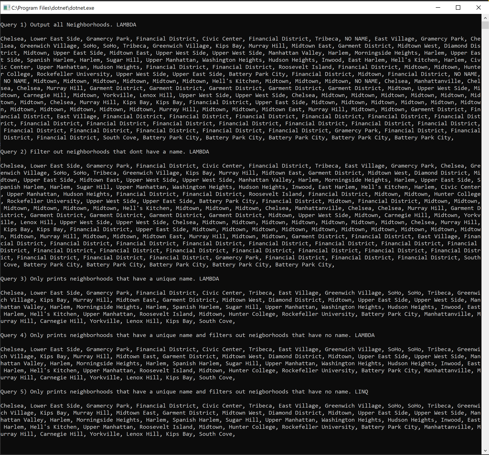

# Lab 08: LINQ in Manhattan
 
## Directions
- Provided is a JSON file that contains a data set of location information for properties in Manhattan.

    - Read in the file and answer the questions below
    - Use LINQ queries and Lambda statements (when appropriate) to find the answers.
    - Use a combination of both to answer the questions.
    - Each question and answer should be outputted to the console.
## Setup
- Add the data.json file to your solution root folder
- Explore the NuGet packages and install NewtonSoft.Json
- Do some self research and find out how to read in JSON file (hint: JsonConvert.DeserializedOject is part of it)
- You will need to break up each section of the JSON file up into different classes, use your resources - ask the TA’s if your stuck. (Maybe find a converter of some sort??)
## Questions
Each query builds off of the next.
  - Output all of the neighborhoods in this data list
  - Filter out all the neighborhoods that do not have any names
  - Remove the Duplicates
  - Rewrite the queries from above, and consolidate all into one single query.
  - Rewrite at least one of these questions only using the opposing method (example: Use LINQ instead of a Lambda and vice versa.)

## Resources
- Quicktype https://quicktype.io/
  - Converts .json files into classes.
- Newtonsoft.json https://www.newtonsoft.com/json/help/html/Introduction.htm
  - Allows you to convert a .json file into an object that can then be parsed into a .NET object.

## Query Output

    

